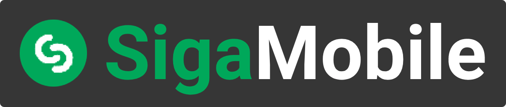

<p align="center">
  
</p>
<p align="center">
   
   
   
   
   
   
   
   
</p>

# Índice <br>
**<a href="#abstract">1 - O que é o SigaMobile?</a><br>**
**<a href="#tech_utilities">2 - Tecnologias utilizadas</a><br>**
**<a href="#requireds">3 - Requisitos para excutar a aplicação</a><br>**
**<a href="#app_exex">4 - Executando a aplicação</a><br>**
<a href="#backend_exex">---| 4.1 - Backend NestJS</a><br>
<a href="#frontend_exex">---| 4.2 - Frontend Android</a><br>
<a href="#fake_users">---| 4.3 - Logins de Teste</a><br>
<a href="#mongo_db">---| 4.4 - Acesso ao MongoDB</a><br>
**<a href="#documentation">5 - Documentação da aplicação</a>**<br>
**<a href="#team">6 - Authors</a>**<br>

<div id="#abstract"></div>

# O que é o SigaMobile? <br>
O SigaMobile é um aplicativo android em desenvolvimento, com o objetivo de disponibilizar ao aluno do IFAM uma forma simples e rápida de acompanhar sua situação acadêmica, permitindo ao aluno consultar suas disciplinas, notas, horários de aulas, histórico acadêmico e etc. <br>

## 🔖 Por quê desenvolvê-lo? <br>
Atualmente o sistema acadêmico disponível aos alunos do IFAM CMZL é bastante problemático, tanto no frontend quanto no backend. No frontend o visual é muito poluido e os alunos perdem muito tempo buscando algo por ser difícil de entender as funcionalidades, além disso no backend, por ser uma aplicação monolítica cresceu bastante, não tem tolerância a falhas, ou seja, a aplicação fica fora do ar caso haja falha ou seja necessário realizar manutenção.<br>

## 💡 Proposta do sistema <br>
A proposta é desenvolver um frontend mobile (Android) e o backend na arquitetura de microsserviços para melhorar determinadas funcionalidades que possuem altas demandas. Com esta arquitetura o sistema também será tolerante a falhas e em caso de manutenção apenas um serviço específico será afetado, não havendo necessidade de deixar a aplicação inteira fora do ar.<br>

<div id="tech_utilities"></div>

## ⚙️ Tecnologias utilizadas:
 **✳️ Linux (Ubuntu ou Debian):** para utilizar a ferramenta Docker com mais compatibilidade e executar shell scripts sem maiores dificuldades.<br>
 **✳️ Docker e docker-compose:** para que o projeto fosse capaz de executar em vários computadores e subir o ambiente de desenvolvimento de maneira mais fácil.<br>
 **✳️ Git e GitHub:** para trabalhar com versões do projeto e manter um repositório online para guardar as atualizações feitas pela equipe de desenvolvimento.<br>
 **✳️ MongoDB:** para criar um banco de dados não relacional que seja capaz de fazer atualizações ou adições de atributos com maior flexibilidade.<br>
 **✳️ NPM:** para utilizar o framework NestJs e gerenciar as dependências do projeto.<br>
 **✳️ Android:** para desenvolver o frontend foi escolhido o Android 10 (API 29), com programação nativa em java, utilizando o gerenciador de pacotes Gradle.<br>
 **✳️ Framework NestJS:** utilizando a linguagem TypeScript, foi escolhido porque apesar de ser um framework recente, foi desenvolvido para ser compatível com novas tecnologias. Na área de microsserviços possui compatibilidade com o **Redis, MQTT, NATS, RabbitMQ, Kafka, gRPC**, além de ter libs para transporters, pipes, guards e interceptors. O gerenciador de microsserviços utilizado neste projeto é o gRPC. O NestJs também tem como padrão próprio o uso de padrões de projetos, utilizando Factory para criar os módulos, Decorator para adicionar funcionalidades em outras classes, como por exemplo a autenticação por JWT para acessar uma API, Strategy para utilizar classes padrões da ferramenta, dentre outros.<br><br>

<div id="requireds"></div>

# Requisitos para rodar aplicação:
✴️ Docker e docker-compose<br>
✴️ De preferência sistema operacional Linux (Ubuntu/Debian)<br>
✴️ Android Studio com **Android 10 (API 29)** e versão **4.1.1** ou superior do **Gradle**. Caso não queira utilizar a IDE basta apenas um celular com **Android 7** ou superior.<br>
✴️ O computador que irá executar a aplicação deve estar na mesma rede (Wifi ou USB tethering) que o celular que irá usar o aplicativo<br>
✴️ O computador deve ter acesso à internet para baixar as dependências do projeto na primeira execução<br>

<div id="app_exex"></div><br>

# Executando a Aplicação
<p>Baixe o repositório:</p>

```bash
git clone https://github.com/rpm-95/SigaMobile.git
```
<div id="backend_exex"></div>

## 🖥️ Backend NestJs
Primeiro certifique-se de que as portas **4040**, **27017**, e **6969** do seu computador não estão sendo utilizadas por outras aplicações, é necessário que as mesmas estejam disponíveis.<br>
Entre na pasta raiz do repositório **"SigaMobile"** e execute o comando:

```bash
# para executar pela primeira vez
./devops/build.sh
```
<p>Aguarde até que o terminal mostre as mensagens abaixo: </p>

```bash
[NestApplication] Nest application successfully started +8ms
[NestMicroservice] Nest microservice successfully started +15ms
[NestMicroservice] Nest microservice successfully started +3ms
[NestMicroservice] Nest microservice successfully started +3ms
```

Após isso o backend da aplicação estará sendo executando.<br><br> 
⚠️ Caso queira continuar utilizando o mesmo terminal será necessário executar o seguinte comando: `ctrl+c`. Pode ser que apareça a mensagem `ERROR: Aborting`, porém não se preocupe, a aplicação continuará rodando em background, apenas o script `build.sh` que será encerrado.
<br>

Caso já tenha executado a aplicação com sucesso anteriomente, pode-se executar os seguintes comandos para iniciar ou parar a execução:<br>

```bash
# para iniciar a aplicação
./devops/app.sh start

# para parar a aplicação
./devops/app.sh stop
```

<div id="frontend_exex"></div>

## 📱 Frontend Android <br>

**-> Para executar com o Android Studio<br>**
1 - Execute o Android Studio e certifique-se de ter o **Android 10 (API 29)** disponível na IDE, após isso abra o projeto **"frontend-android"** que está no diretório raiz do repositório. Aguarde o Gradle baixar as dependências do projeto e sincronizar.<br>
2 - Conecte seu celular ao computador e espere a IDE identificar o dispositivo, e instale no seu celular via cabo USB. Se preferir também pode ser executado no Emulador do Android<br>

**-> Para executar utilizando o APK<br>**
Abra a raiz do repositório, conecte seu celular ao computador e copie o arquivo **"siga_mobile.apk"** para o celular. Em seguida execute o APK para instalar o aplicativo.<br>
Obs.: pode ser que o celular solicite permissão para instalar arquivos de origem desconhecida, basta aceitar a instalação e prosseguir.<br>

<div id="fake_users"></div>

## 🧑 Logins para teste<br>
Para utilizar a aplicação você pode usar os dados abaixo:<br><br>
-> Usuário já cadastrado no sistema:<br>
--| **nome:** `João Melo da Costa` <br>
--| **usuário:** `joaomelo`<br>
--| **senha:** `password`<br>
--| **matrícula:** `2019025996`<br>
--| **rg:** `358867`

-> Usuário a ser cadastrado (primeiro acesso):<br>
--| **nome:** `Eduarda Souza Campos` <br>
--| **matrícula:** `2019025096`<br>
--| **rg:** `448868`<br>

⚠️ No primeiro acesso o aluno irá se cadastrar no sistema, criando seu login e senha. O sistema só deve aceitar o cadastro de alunos matrículados, para fazer esta verificação é utilizado a matrícula e o RG do aluno.<br>

<div id="mongo_db"></div>

## 📦 Acesso ao MongoDB<br>
Caso queira acessar o MongoDB via terminal, na raiz do repositório execute o seguinte comando:

```bash
# para iniciar o bash do MongoDB
./devops/mongobash.sh
```
⚠️ O comando acima só funciona enquanto os containers estiverem sendo executados.<br>

<div id="documentation"></div><br>

# Documentação do projeto
Para vizualizar a documentação contendo o protótipo, requisitos funcionais, histórias de usuário e testes de usabilidade acesse o link abaixo: <br>
[Clique aqui para ver a documentação da aplicação](https://adventurous-weaver-078.notion.site/SigaMobile-274cdacfb6c640928a7c7a4a3738395e) <br>

<div id="team"></div>

# Authors <br>
[Rodrigo Perote](https://github.com/rpm-95) - MIRCROSERVICES | Login, Authorization e criar novo usuário (primeiro acesso) <br>
[Thalles Kaik](https://github.com/thallesk17) - MIRCROSERVICE | Emitir atestado de Matrícula <br>
[Bernardo Amazonas](https://github.com/badc-2000) - MIRCROSERVICE | Visualizar notas e horários de aula <br>
[Gabriel Costa](https://github.com/GabrielCostaSilvaa) - MIRCROSERVICE | Atualização de dados pessoais <br>git